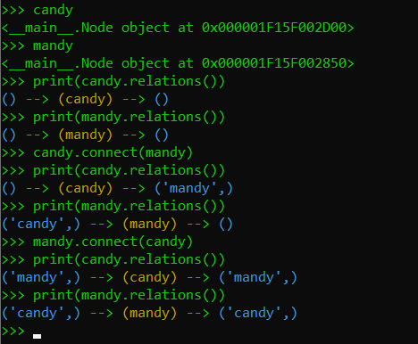
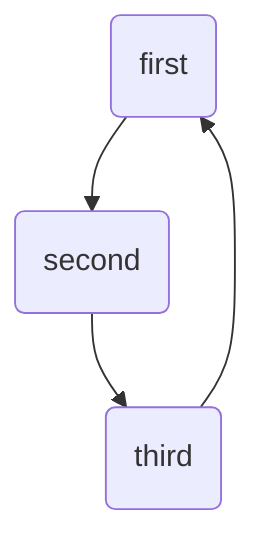
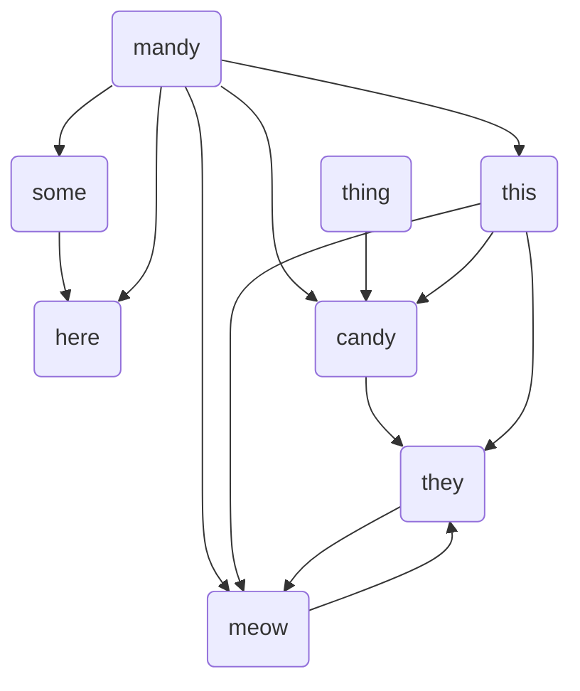
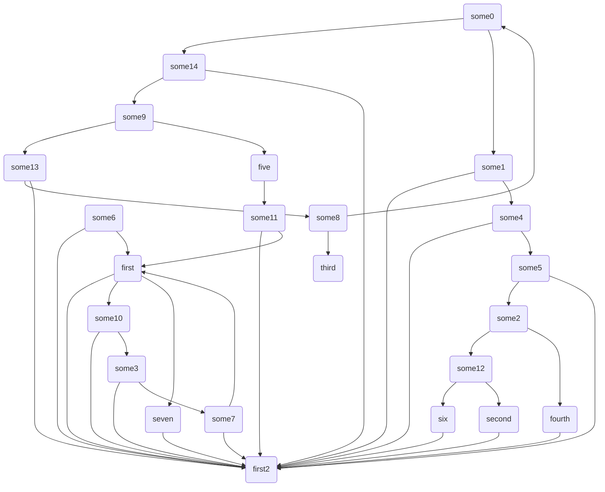

# fancy-mermaid
tool for making fancy mermaid graphs


## two nodes relations



## example code

```python
# ********* create nodes *********
some = Node('some', max_inputs=1, max_outputs=1)
thing = Node('thing', max_inputs=0, max_outputs=1)
here = Node('here', max_inputs=2, max_outputs=0)
they = Node('they', max_inputs=3, max_outputs=2)
this = Node('this', max_inputs=1, max_outputs=3)
meow = Node('meow', max_inputs=3, max_outputs=1)
mandy = Node('mandy', max_inputs=1, max_outputs=1)
candy = Node('candy', max_inputs=1, max_outputs=1)
nodes = [some, thing, here, they, this, meow, mandy, candy]

# ********* create fancy mermaid *********
fancy = Fancy(nodes)
fancy.roll(quiet=False)
mermaid = fancy.make_mermaid(brackets='round')
print(mermaid)
write_file('mermaid.txt', mermaid)
```


## fancy graphs examples



---



---



## think of\todo

:black_square_button: what if choice is in the list of inputs or outputs for a given node? then we don't lose shots, but we don't find any input/output. This needs to be fixed somehow by giving a while loop, or appropriate conditions that will filter out correctly available input and output nodes

:white_check_mark:  `allow_reverse` - allow for reverse connections between nodes. In other case only one way connection is allowed. Its fine for now
    
:black_square_button: implement somy copy method for node? https://stackoverflow.com/questions/45051720/best-practice-to-implement-copy-method
        
:black_square_button: what about the random order of pairing inputs and outputs? currently we iterate first all inputs and then all outputs, so the results are not fully random
    
:black_square_button: I realize that node should keep it restrictions independ on Fancy class object (todo, make sure its ok)
    
:black_square_button: relation between nodes should be make in one node, for both of them, to not be omitted
    
:white_check_mark: remove `make_input` and `make_output` methods for Node class and implement fully `connect` method (also in Fancy class)
 
